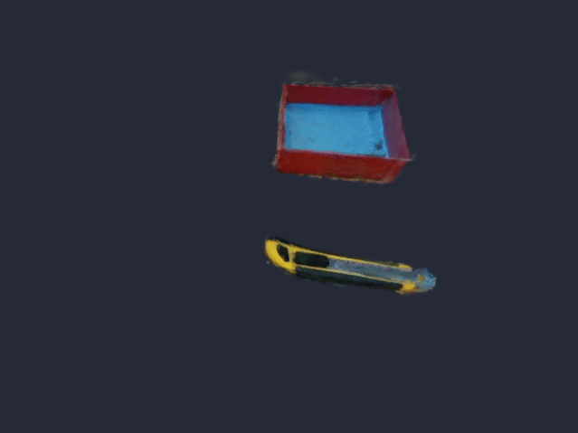

# Forecast-aware Gaussian Splatting for End-to-End Robot Manipulation

[](https://python.org)
<!-- [](https://icra2025.org/) -->

> An approach combining Gaussian Splatting with robotic manipulation.

## 📋 Table of Contents

- [Demo](#demo)
- [Features](#features)
- [Quick Start](#quick-start)
- [Installation](#installation)
- [Usage Guide](#usage-guide)
  - [Camera Calibration](#camera-calibration)
  - [Scene Processing](#scene-processing)
  - [Training & Visualization](#training--visualization)
  - [Path Planning](#path-planning)
  - [Robot Execution](#robot-execution)

## 🎬 Demo

### Forecast Gaussian Splatting
<div align="center">
  
</div>

### Real Robot Manipulation
<div align="center">
  
</div>

## ✨ Features

- **Real-time 3D Scene Understanding**: Leverage Gaussian Splatting for dynamic scene representation
- **End-to-End Pipeline**: From natural language to robot execution
- **UR5 Robot Integration**: Direct execution on Universal Robots UR5

## 🚀 Quick Start

### Installation

Install all dependencies with a single command:

```bash
pixi r build
```

### Environment Setup

Activate the development environment:

```bash
pixi shell
```

## 📖 Usage Guide

### 1. Camera Calibration

Before training, ensure both wrist-mounted and third-person cameras are properly calibrated using ArUco markers:

```bash
cd src/pogs/scripts
python calibrate_cameras.py
```

### 2. Scene Processing

#### Generate Path with ReKep
```bash
pixi r rekep
```

#### Capture Scene Data
Capture trajectory data for your specific scene (manual trajectory supported):

```bash
python src/pogs/scripts/scene_capture.py --scene box
```

### 3. Training & Visualization

#### Train Gaussian 3D Features
Train the POGS model for 4000 iterations:

```bash
ns-train pogs --data src/pogs/data/utils/datasets/box
```

#### Object Clustering Workflow
After training completion, follow these steps to define and save object clusters:

1. **Cluster Scene**: Click "Cluster Scene" button (wait 10-20 seconds)
2. **Verify Clusters**: View objects as specific clusters
   - If clustering fails: Toggle RGB/Cluster and adjust Cluster Eps (lower values often work better)
3. **Toggle View**: Switch back to RGB view with "Toggle RGB/Cluster"
4. **Select Objects**: Click on desired object (green ball indicator will appear)
5. **Isolate Object**: Click "Crop to Click" to isolate the selected object
6. **Set Origin**: Drag the coordinate frame to set object origin (used for reset/servoing alignment)
7. **Save to Group**: Click "Add Crop to Group List"
8. **Repeat**: Follow steps 4-7 for all scene objects
9. **Review**: Click "View Crop Group List" to verify all objects

> ⚠️ **Important**: Save the config file and checkpoint directory paths from the terminal output.

#### Visualize Gaussian Splats
```bash
ns-viewer --load-config outputs/box/pogs/2025-09-09_143905/config.yml --viewer.websocket-port 8007
```

### 4. Path Planning

#### Generate Final State Output
```bash
python scripts/sample_and_filter_poses.py
```

#### Bi-RRT Path Planning
Generate collision-free trajectories using Bi-directional Rapidly-exploring Random Trees:

```bash
python scripts/BiRRT_Cons.py
```

#### Animation Preview
Visualize the planned robot actions before execution:

```bash
python scripts/generate_action_animation.py
```

### 5. Robot Execution

#### Single Execution on UR5
```bash
python scripts/execute_subgoals.py
```

#### Cyclic Execution
For repeated task execution:

```bash
python scripts/cyclic_execute_subgoals.py
```

## Bibtex
Thanks to POGS entire framework:
```
@article{yu2025pogs,
  author    = {Yu, Justin and Hari, Kush and El-Refai, Karim and Dalil, Arnav and Kerr, Justin and Kim, Chung-Min and Cheng, Richard, and Irshad, Muhammad Z. and Goldberg, Ken},
  title     = {Persistent Object Gaussian Splat (POGS) for Tracking Human and Robot Manipulation of Irregularly Shaped Objects},
  journal   = {ICRA},
  year      = {2025},
}
```
